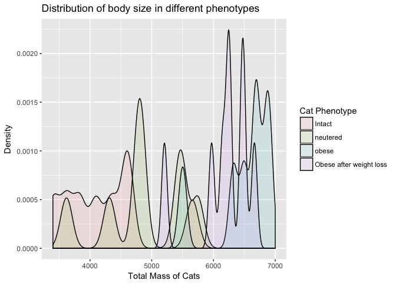
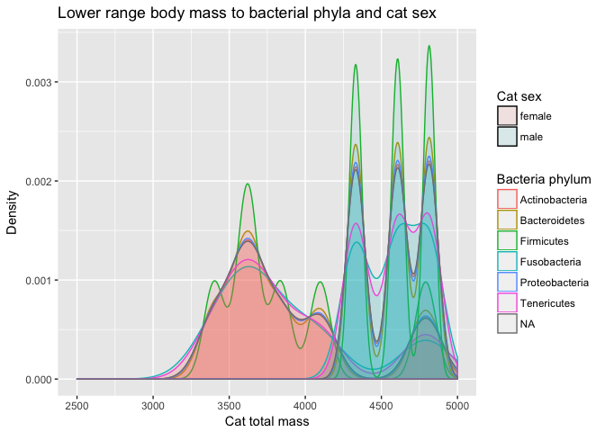

Final Report: Your Title Here
================
Don Francisco
November 22, 2017

Introduction
============

REFERENCE: 2-3 pages will be 1000-1500

-   Domestication of cats
-   Our love for cats
-   Being obese, as well as for humans, will cause early death, include statistics
-   What if it's not just diet? Does neutering play a role? Population control is important too. Here I ask if there are particular bacterias within striclty obese, neutered cats that is preventing them from maintaining a healthy weight? If so, can this lead to a positive medication which can be administered to the cats?
-   In the study by so and so, they studied intact and neutered cats in order to find a connection between obesity and being neutered.

Add about 2-3 pages here. Across the whole manuscript, you should cite at least 20 peer reviewed articles.

Methods
=======

Study design
------------

REFERENCE: 250 words = 1/2 page

Add about half a page here. In this section instead of first person (I/we), use the authors of the paper you selected, since you'll just be describing what they did, based on the methods in their paper.

Sample origin and sequencing
----------------------------

REFERENCE: 250 words = 1/2 page

Add about half a page here. In this section instead of first person (I/we), use the authors of the paper you selected, since you'll just be describing what they did, based on the methods in their paper.

Computational
-------------

REFERENCE: 250-500 words

These are the methods you used to do your bioinformatic analyses analyses. Should probably be between 0.5 and 1 pages. At a very minimum should include citations for DADA2 and phyloseq if you are doing an amplicon study, or other citations as appropriate.

Results
=======

Subsections are ok in the results section too
---------------------------------------------

``` r
load("output/phyloseqobject.RData")
```

``` r
# COMMENT HERE
ggplot(data=melted_obj, 
          aes(x=host_sex_s, y=Abundance)) +
  geom_point() +
  facet_grid(. ~ host_phenotype_s)
```


**Figure 1:** A grid plot of abundance of female and male cats whom are intact, neutered, obese, and who were obese before weight loss.

``` r
# Comment here
ggplot(data=melted_obj, 
          aes(x=host_sex_s, y=Abundance)) +
  geom_point() +
  facet_grid(. ~ Phylum)
```


**Figure 2**: A grid plot of the abundance of certain phylums in both males and females.


**Figure 3**: A bar plot indicating different ages between the categories intact, neutered, obese, and obese after weight loss among females and males.


**Figure 4**: A bar plot showing age against phylum and category of intact, neutered, obese, and obese after weight loss.

``` r
# Comment here
melted_obj %>%
ggplot(aes(host_tot_mass_s, fill = host_phenotype_s, colour = host_phenotype_s)) +
  geom_density(alpha = 0.1) +
  xlim(3400, 7000)
```



**Figure 5**: A density plot of host's total mass to its phenotype.

``` r
# Comment here
melted_obj %>%
ggplot(aes(host_tot_mass_s, fill = host_sex_s, colour = Phylum)) +
  geom_density(alpha = 0.1) +
  xlim(2500, 5000)
```

    ## Warning: Removed 11533 rows containing non-finite values (stat_density).



**Figure 6**: A density plot of the lower range weight class of females and males and the correlating Phylums.

``` r
# Comment here
melted_obj %>%
ggplot(aes(host_tot_mass_s, fill = host_sex_s, colour = Phylum)) +
  geom_density(alpha = 0.1) +
  xlim(5500, 7000)
```

    ## Warning: Removed 9105 rows containing non-finite values (stat_density).


**Figure 7**: A density plot of the upper range weight class of females and males and the correlating Phylums.

In addition to a minimum of 5-10 figures/tables (and associated captions), you should include sufficient text in this section to describe what your findings were. Remember that in the results section you just describe what you found, but you don't interpret it - that happens in the discussion. 2-3 pages.

Discussion
==========

REFERENCE: 1500-2000 words

Add around 3-4 pages interpreting your results and considering future directions one might take in analyzing these data.

Sources Cited
=============
