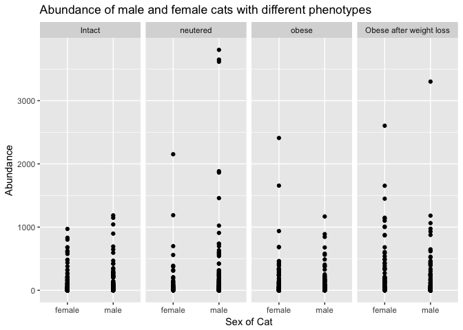
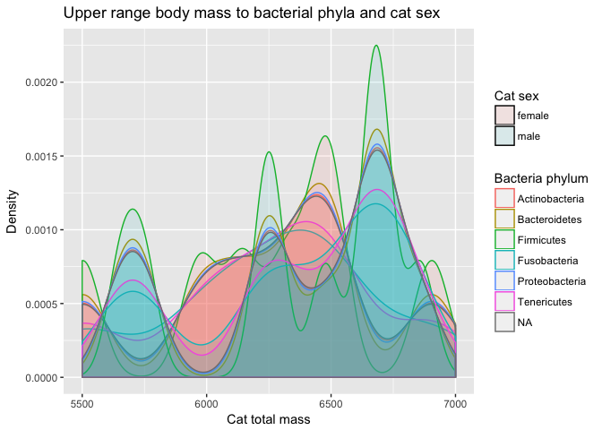
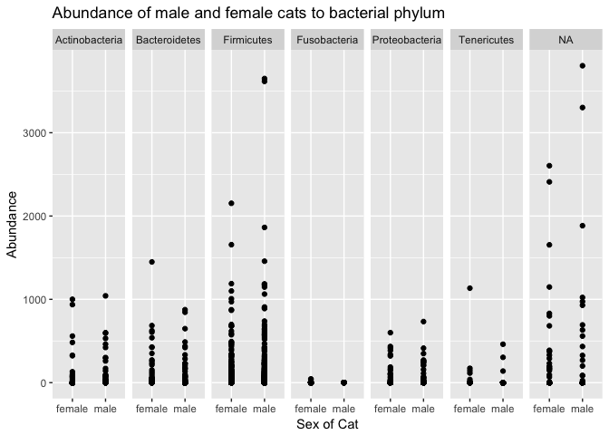
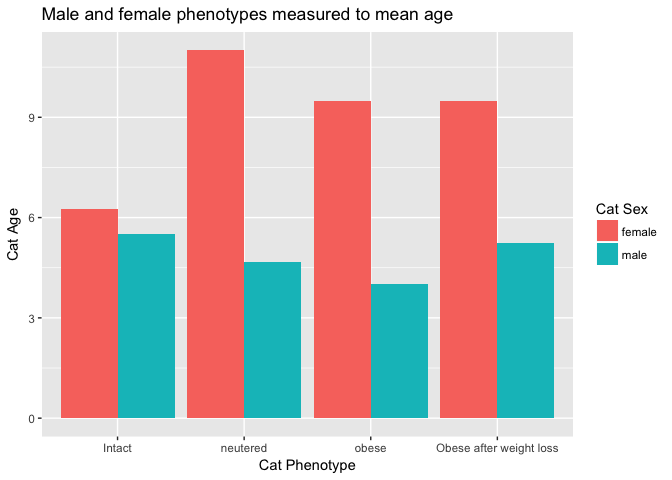

Final Report: The Effects of Neutering on Female and Male Adult Cats
================
Chelsea Noack
November 29, 2017

Introduction
============

REFERENCE: 2-3 pages will be 1000-1500

-   Domestication of cats
-   Our love for cats
-   Being obese, as well as for humans, will cause early death, include statistics
-   **HYPOTHESIS**: Females will be larger overall, especially after neutering, than male cats. This puts female cats at a severe disadavntage.
-   What if it's not just diet? Does neutering play a role? Population control is important too. Here I ask if there are particular bacterias within striclty obese, neutered cats that is preventing them from maintaining a healthy weight? If so, can this lead to a positive medication which can be administered to the cats?
-   In the study by so and so, they studied intact and neutered cats in order to find a connection between obesity and being neutered.

Add about 2-3 pages here. Across the whole manuscript, you should cite at least 20 peer reviewed articles.

Methods
=======

Study design
------------

Fischer et al. used twenty-four cats from the University of California, Davis with a median age of 6.4 years. All cats were pathogen free domestic shorthairs. From the twenty-four cats, eight of the cats were obese with four males and four females. Eight cats were lean and not neutered, again with four males and four females. Eight cats, six males and two females, were lean and neutered (Fischer *et al.*, 2017). All twenty-four cats had the same diet before and during the study. Every cat underwent a physical and blood sample before the experiment began.

Cats which were lean and both neutered or not neutered housed together. All had the same diet *but* their intake was not measured. The night before the fecal sampling, the cats slept alone. Fischer et al. performed BCS (body composition scores) for each cat before sampling.

The obese, neutered cats underwent castration/spaying 1-6 years before the study (Fischer *et al.*, 2017). Unlike the lean cats, the obese cats slept alone. The obese neutered ate the normal diet given to all cats for ten days. For six weeks, they ate 60-70% of the prior intake. Again, unlike the lean cats, their intake was now measured. Fischer et al. recorded the cats' weights every week. They also recorded fecal samples before and after the dietary restriction began (Fischer *et al.*, 2017).

Sample origin and sequencing
----------------------------

Before sequencing the data, Fischer et al. collected fecal samples from the cat litter box once a day for three days straight. They monitored the cats and they did not collect any samples which were 15 minutes old. To get the bacterial DNA, Fischer et al. used bead-beating methods. Bead-beating is a way to release DNA, RNA, and proteins in the cells of a sample. They used a commercial DNA extraction kit (Fischer *et al.*, 2017). To bead-beat, samples go in tubes then on a homogenizer. A homogenizer which is a lab tool used to mix materials using high energy. They mixed "for 60 seconds at a speed of 4 m/s" (Fischer *et al.*, 2017).

The 16S rRNA amplified using a universal bacterial primer. A universal bacterial primers is important to interpret PCR results. Especially for microbial communities (Mao *et al.*, 2012). PCR (polymerase chain reaction) is a technique used to make a lot of copies of a segment of DNA.

After PCR amplification, Fischer et al. added amplicon products of different samples. They purified the samples using AgencourtAmpure beads. The beads were important for high-throughput purification of the PCR amplicons. Then the samples combined in equal concentrations. Fischer et al. sequenced th samples using Roche 454 FLX titanium instruments (Fischer *et al.*, 2017). Pyrosequencing using instruments like Roche 454 have big advantages versus traditional Sanger sequencing. Primarily because they can examine many samples from many microbial communities (Tamaki *et al.*, 2011). Once the raw sequences were complete, I downloaded them for my analysis. I downloaded them from NCBI’s Sequence Read Archive (<http://www.ncbi.nlm.nih.gov/Traces/sra>) under accession no. SRP066010.

Computational
-------------

First, I downloaded the data from the provided link. This was a two-part process. First, I had to download the SRAtoolkit from NCBI's website. Because the data I used was in .sra format, the toolkit converts it to .fastq. I wanted .fastq so I could perform a quality check later on. After downloading the toolkit, I performed a check to make sure it worked. The steps taken came from the toolkit's website (<https://www.ncbi.nlm.nih.gov/books/NBK158900/>). Once I assured that it worked, I wrote a Bash script which downloaded the data into my computer. Because the files were fairly small, this did not take much time. The files downloaded into my raw data folder and saved as fastq, thanks to the toolkit.

With the data downloaded into my computer, I transferred it to RStudio to begin my analysis. In order to do so, I downloaded necessary, but helpful, libraries. The libraries included dplyr, tidyr, knitr, ggplot2, citr, seqinr, mctoolsr, dada2, and phyloseq. Dplyr, tidyr, knitr, and ggplot2 are general use packages to help analyze the data.

DADA2 and phyloseq were extremely important for this process. DADA2 comes from bioconductor. Bioconductor serves as the primary package to clean up and analyze our data. DADA2 specifically cleans up amplicon errors (Callahan *et al.*, 2016). It can also extract sample names from their original .fastq names. Phyloseq takes on microbiome analysis in R (McMurdie and Holmes, 2013). Once all files downloaded and organized, I did a QC (quality check) report on each individual file.

Initially, I trimmed the files based off of only the QC scores (they dropped around ~400 bp). After later reviewing the amount of errors in the sequences, I decided to extend the trim to 600. To counterbalance this, I made sure the quality cut off was at a smaller number (originally at 5, now at 2). Thus, we would get more data to analyze with adequate quality. After a proper trim and error check, I deleted any duplicate sequences. 454 Roche technology sequenced the data, so I used the suggested parameters based off of (<https://benjjneb.github.io/dada2/>). This is when DADA2 proved to be vital, as it facilitated the process for my specific amplicon data set. In the final steps, I observed the distribution of trimmed and denoised sequences. While the data was poorly sequenced, for my purposes it would work alright. Then, I removed chimeras.

Now, the data given is fully processed. Before analysis, I created a metadata table and a melted table to observe during research.

Results
=======

The data proved to be interesting and not perfectly correlated to my hypothesis. I began my analysis using a grid plot in figure 1 of the overall abundance of the four sample groups between males and females. In the figure, we see that males who are neutered are in the highest abundance, followed by males who are obese undergoing weight loss and females who are obese undergoing weight loss. In the least abundance is males who are intact, obese males, and females who are intact. Given this information, I went forward and created a density plot of the overall abundance of total mass between the four sample groups. While this did not include sex, it indicated that, generally, cats obese undergoing weight loss were the most dense. The second-most dense were the obese cats. The least dense were intact cats whom kept a generally uniform distribution of total mass. That cats who were neutered were neither most or least dense, but showed the greatest range of total body mass.

**The role of body mass**

After analyzing the abundance of different phenotypes by sex and the distribution of body masses, I wanted to look deeper into the body mass question. What were the mean body masses among the four phenotypes for both male and female cats? In Table 1, the phenotype with the highest mean body mass are the obese undergoing weight loss female cats, followed by obese male cats undergoing weight loss. The phenotype with the lowest mean body mass are the intact male cats, followed by intact females. The medians of body mass are obese male cats and neutered female cats. Given the information in Table 1, I wanted to see it visually. Figure 3 depicts Table 1, and in it we see that the difference between females and males in terms of body mass to phenotype is not very significant. The most difference is between intact females and males. The obese cats undergoing weight loss are nearly similar between males and females. We see the general trend of increased body mass and phenotype along both sexes with males being generally larger.

**The role of microbial communities**

Next, I wanted to see which microbial communities were playing a role, if at all. Thus, I made a density plot indicating the abundance of certain microbial communities in different phenotypes and sexes. Figure 4 indicates the lower range of body masses from the data, while Figure 5 shows the upper range. I divided these graphs for better visualization of the data as there were many data points to take into account. In Figure 4, we see that female cats dominate the lower weight range class among all phenotypes, showing a fairly normal distribution. Firmicutes shows the highest abundance in the lower weight ranges of both males and females. In Figure 5, males dominate the upper body weight range with uneven peaks, while females have a moderate range with only two dominant peaks. Firmicutes, again, have the highest density of both males and females. Visibly, Bacteriodetes also have a high density between the two sexes. Proteobacteria and Fusobacteria have intense fluctuations between sex and body mass.

The microbial community question continued to linger, so I dug further. In Figure 6, I used a grid plot instead for better visualization of my question. We see a new phylum option as 'not applicable' having the highest abundance of female and male cats. After, Firmicutes, Bacteriodetes, and Actinobacteria. The lowest abundance is Fusobacteria, Proteobacteria, and Tenericutes.

``` r
load("output/phyloseqobject.RData")
```

``` r
# First figure indicating the general schema of the data
ggplot(data=melted_obj, 
          aes(x=host_sex_s, y=Abundance)) +
  geom_point() +
  facet_grid(. ~ host_phenotype_s) +
  labs(title = "Abundance of male and female cats with different phenotypes",
       x = "Sex of Cat")
```



**Figure 1:** A grid plot of abundance of female and male cats whom are intact, neutered, obese, and who were obese before weight loss.

``` r
# Second figure using density to show the range of body mass to phenotype
melted_obj %>%
ggplot(aes(host_tot_mass_s, fill = host_phenotype_s)) +
  geom_density(alpha = 0.1) +
  xlim(3400, 7000) +
  labs(title = "Distribution of body size in different phenotypes",
       x = "Total Mass of Cats", 
       y = "Density", 
       fill = "Cat Phenotype")
```


**Figure 2**: A density plot of host's total mass to its phenotype.

| host\_phenotype\_s      | host\_sex\_s |  mean\_bodymass|
|:------------------------|:-------------|---------------:|
| Obese after weight loss | female       |        5949.000|
| Obese after weight loss | male         |        6410.250|
| obese                   | female       |        6306.000|
| obese                   | male         |        6746.667|
| neutered                | female       |        4205.500|
| neutered                | male         |        5103.333|
| Intact                  | female       |        3739.750|
| Intact                  | male         |        4804.750|

**Table 1**: Mean body mass among phenotypes and sexes.

``` r
meanmass_8 %>%
  ggplot(aes(x = host_sex_s,
             y = mean_bodymass,
             fill = host_phenotype_s)) +
    geom_col(position = "dodge") +
  ggtitle("Cat sex to mean body mass over four phenotypes") +
  xlab("Cat Sex") + ylab("Mean Body Mass") + labs(fill = "Cat Phenotype")
```


**Figure 3**: Using the table, the mean body mass visualized with a bar graph.

``` r
# Comment here
melted_obj %>%
ggplot(aes(host_tot_mass_s, fill = host_sex_s, colour = Phylum)) +
  geom_density(alpha = 0.1) +
  xlim(2500, 5000) +
  ggtitle("Lower distribution of body mass across bacterial phyla and cat sex") +
  xlab("Cat total mass") + ylab("Density") + labs(fill = "Cat sex", colour = "Bacteria phylum")
```

    ## Warning: Removed 11533 rows containing non-finite values (stat_density).


**Figure 4**: A density plot of the lower range weight class of females and males and the correlating Phylums.

``` r
# Comment here
melted_obj %>%
ggplot(aes(host_tot_mass_s, fill = host_sex_s, colour = Phylum)) +
  geom_density(alpha = 0.1) +
  xlim(5500, 7000) +
    ggtitle("Upper distribution of body mass across bacterial phyla and cat sex") +
  xlab("Cat total mass") + ylab("Density") + labs(fill = "Cat sex", colour = "Bacteria phylum")
```

    ## Warning: Removed 9105 rows containing non-finite values (stat_density).



**Figure 5**: A density plot of the upper range weight class of females and males and the correlating Phylums.

``` r
# Comment here
ggplot(data=melted_obj, 
          aes(x=host_sex_s, y=Abundance)) +
  geom_point() +
  facet_grid(. ~ Phylum) +
  labs(title = "Abundance of male and female cats to bacterial phylum",
       x = "Sex of Cat")
```



**Figure 6**: A grid plot of the abundance of certain phylums in both males and females.



**Figure 3**: A bar plot indicating different ages between the categories intact, neutered, obese, and obese after weight loss among females and males.


**Figure 4**: A bar plot showing age against phylum and category of intact, neutered, obese, and obese after weight loss.

CONCLUSION

Discussion
==========

REFERENCE: 1500-2000 words

Add around 3-4 pages interpreting your results and considering future directions one might take in analyzing these data.

Sources Cited
=============

Callahan,B.J. *et al.* (2016) DADA2: High-resolution sample inference from illumina amplicon data. *Nature Methods*, **13**, 581–583.

Fischer,M.M. *et al.* (2017) Effects of obesity, energy restriction and neutering on the faecal microbiota of cats. *British Journal of Nutrition*, **118**, 513–524.

Mao,D.-P. *et al.* (2012) Coverage evaluation of universal bacterial primers using the metagenomic datasets. *BMC microbiology*, **12**, 66.

McMurdie,P.J. and Holmes,S. (2013) Phyloseq: An r package for reproducible interactive analysis and graphics of microbiome census data. *PLoS ONE*, **8**, e61217.

Tamaki,H. *et al.* (2011) Analysis of 16S rRNA amplicon sequencing options on the roche/454 next-generation titanium sequencing platform. *PloS one*, **6**, e25263.
